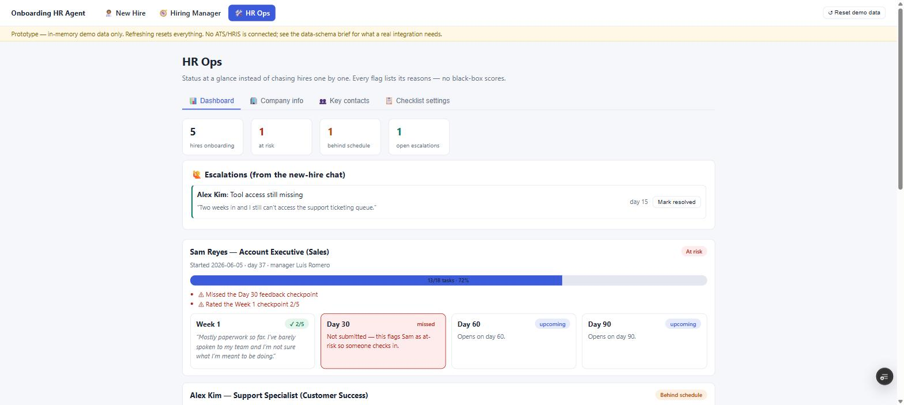
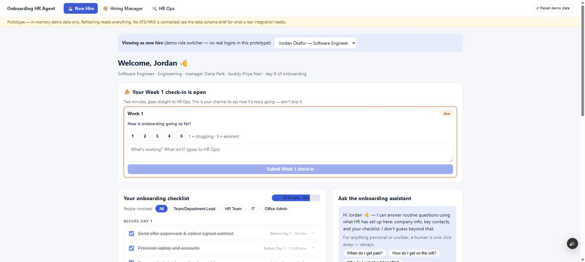
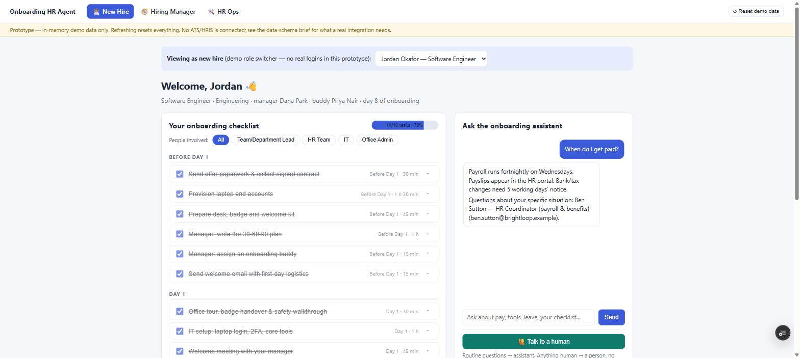
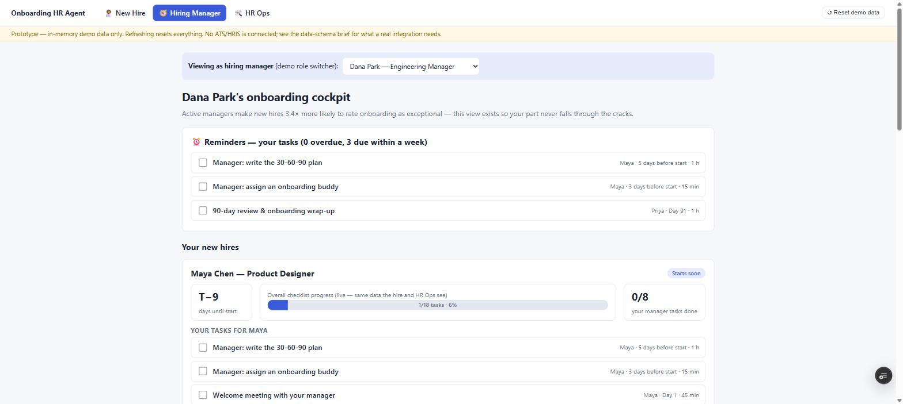
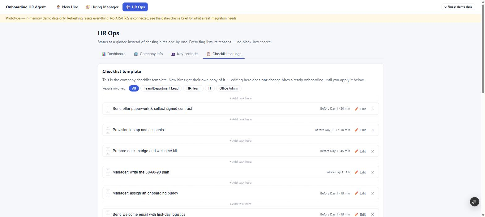

# Onboarding HR Agent — run-1

A working front-end prototype of a three-sided onboarding tool, built against sourced 2025–2026 onboarding failure data (see `master-prompt.md` at the repo root for the sources, and `build-log.md` here for the feature-to-pain-point mapping).

**Live demo:** https://hr-onboarding-b93kycaik-nicosciences-projects.vercel.app

## 2-minute demo walkthrough

**1. HR Ops → Dashboard.** Sam Reyes is flagged At risk (missed the Day-30 checkpoint, rated Week 1 2/5), Alex Kim is Behind schedule, and there's one open escalation waiting on HR.



**2. New Hire (Jordan) — submit a Week-1 check-in.** Submitting a low rating (1/5) immediately surfaces on HR Ops, flagging Jordan at-risk too. Same data, live, everywhere.



**3. Ask the chat, then escalate.** The chat panel only answers from HR-configured content (company info, contacts, FAQs, the hire's own checklist). Asking "when do I get paid?" pulls the real payroll answer and the right HR contact; anything it can't know routes to a human via the always-visible "Talk to a human" button instead of guessing.



**4. Hiring Manager (Dana Park).** Dana's reminders list overdue/upcoming tasks per report; checking one off moves that hire's progress bar, the same shared state the other two views see.



**5. HR Ops → Checklist settings.** Reorder a task, insert one mid-list, edit it in place, delete it, then apply the updated template to hires already onboarding.



## Contents

| Path | What it is |
|---|---|
| `app/`, `components/`, `lib/` | The Next.js 15 + React 19 + TypeScript app (the live prototype, at repo root) |
| `build-log.md` | Scoping Q&A (self-answered in character), design decisions traced to sourced pain points, break-it pass, done-check |
| `data-schema-brief.md` | What a real ATS/HRIS integration would need, entities, sync direction, auth, notifications, and what the prototype honestly can't do |

## Run the live prototype

```bash
npm install
npm run dev
```
Then open http://localhost:3789

`npm run build && npm start` for a production build. `<SpeedInsights/>` (`@vercel/speed-insights/next`) is mounted in `app/layout.tsx`; it no-ops locally and activates if the app is ever deployed on Vercel.

## Deploy to Vercel

The app is deployment-ready: standard Next.js 15, no env vars required, no backend, all routes prerender statically. The app lives at the repo root, so no Root Directory override is needed. Deploy either via the CLI (`npx vercel` from the repo root, then `npx vercel --prod`) or by importing the repo in the Vercel dashboard as-is; the framework preset auto-detects as Next.js, so the default build settings are fine.

`.env.local` (a Vercel CLI artifact with a short-lived OIDC token) and `.vercel/` are gitignored, don't commit them; Vercel regenerates both on demand.

After the first deployment, enable Speed Insights for the project in the Vercel dashboard (Project then Speed Insights), the `<SpeedInsights/>` component is already mounted and starts reporting as soon as it's enabled.

Deployment note: the three views render client-side only (`ClientGate`) because all demo state derives from "days since start date" relative to the viewer's current date, baking it into build-time HTML would go stale and cause hydration mismatches. The brief prerendered fallback ("Loading demo data…") is expected.

## The three views

**/new-hire** is an interactive checklist (timing, duration, people involved with a four-group filter, action items, deliverables), feedback check-ins at Week 1 / Day 30 / 60 / 90, and a chat panel grounded only in HR-configured content with a permanently visible Talk to a human escalation.

**/manager** shows the hiring manager's own tasks per hire, overdue/upcoming reminders, open escalations from their hires, and live progress plus check-in feedback for each report.

**/hr-ops** is a dashboard (per-hire health with transparent reasons: on-track, behind, or at-risk, plus an escalation queue), company info and FAQs (the assistant's grounding), key contacts, and checklist template settings with full mechanics: reorder, insert a task between any steps, in-place editing, delete, and an explicit apply-template-to-existing-hires action.

## Demo notes (honest limits)

One shared in-memory state per browser tab is used, that's why all three views stay consistent as you click around, and why refresh resets the demo ("Reset demo data" in the nav does it on purpose). The role pickers ("viewing as…") stand in for auth; there are no logins, no persistence, no notifications, and no ATS/HRIS connection, see `data-schema-brief.md` for what a real one requires. Seed data is generated relative to today so the dashboard always demonstrates every state: pre-start (Maya), healthy day 7 with a Week-1 check-in due (Jordan), behind schedule (Alex), at-risk via missed Day-30 checkpoint plus low Week-1 rating (Sam), and near-graduation (Priya).

## Credits and origin

The idea for an AI-assisted onboarding agent came from "How to build Onboarding HR Agent with Claude", https://thehroffice.substack.com/p/how-to-build-an-onboarding-hr-agent, published May 29, 2026. Credit for the concept goes there.

Everything in this repository, however, is an independent build made afterward. No code, text, or design was copied from that article, the actual implementation came from the goal prompt below, given directly to Claude, which then produced the data model, UI, and every product decision in this repo from scratch.

Goal prompt given to Claude:

Build a working prototype of an Onboarding HR Agent with three views: (1) New Hire, an interactive checklist plus a chat panel for questions, with an escalate-to-a-human option always visible; (2) Hiring Manager, tasks assigned to them, visibility into their new hire's progress, and reminders, since actively-involved managers produce far better onboarding outcomes; (3) HR Ops, company info, key contacts, checklist settings, and a simple dashboard showing which new hires are behind schedule or flagged as at-risk of early attrition. Checklist tasks need timing, duration, people involved (grouped into Team/Department Lead, HR Team, IT, Office Admin, with a filter), action items, and deliverables; must be reorderable, editable in place, and insertable between existing steps. Build in short feedback checkpoints at key milestones (e.g. week 1, day 30, day 60, day 90) so new hires always have a chance to report how it's going. Ship a live prototype, exportable front-end code, and a short data-schema brief describing exactly what a real ATS/HRIS integration would need; do not build actual backend auth, persistence, or integration.

See `master-prompt.md` for the full sourced-research brief this prompt was built on, and `build-log.md` for how it was scoped and executed.
